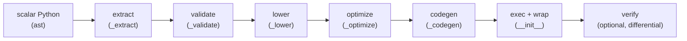

# Architecture

`vectorizer` is a source-to-source compiler. The pipeline runs eagerly
at decoration time:

## Stages

- **extract** — reads the function's AST, signature, defaults, and
  closure environment; resolves lambdas and nested pure functions.
- **validate** — rejects unsupported constructs, collecting *all*
  violations with line/column positions before failing.
- **lower** — the semantic core: scalar control flow (`if`/`else`, early
  returns, `range` loops) becomes `xp.where` merges and explicit loop
  phis; scalar operations become Array API calls; dtype/kind inference
  (`_numeric_kind`, maybe-bool tracking) decides where the exactness
  helpers are needed.
- **optimize** — IR-level constant folding, dead-code elimination, and
  common-subexpression elimination on the scalar program.
- **codegen** — emits readable Python source from the lowered IR (SSA
  names, real loop structure).
- **exec + wrap** — compiles the source and wraps it so the namespace is
  taken from the call arguments (`array_api_compat.array_namespace`);
  `vec.source` and `inspect.getsource` expose the generated text.
- **verify** — with `verify=example_args`, runs a differential check of
  the generated function against the scalar original at generation time.

## Runtime helpers

Some lowerings cannot be expressed with bare Array API calls without
losing exactness (strict backends reject boolean arithmetic and
mixed-dtype promotion; naive casts round uint64 values). For those, the
generated code calls small runtime helpers injected into its globals:

- `_vec_minmax(xp, is_min, *args)` — exact `min`/`max` over mixed
  operands: boolean arrays normalize to int8, mixed-kind selections
  promote to the widest holding dtype, never-winning literals are
  clamped, and identical-dtype fast paths pass through untouched.
- `_vec_arith(xp, op_id, left, right=None)` — exact integer arithmetic
  for boolean/maybe-boolean/uint64 operands: implements the layered
  [exactness lattice](semantics.md#integer-exactness-lattice), including
  per-lane-exact uint64 `mod`/`floordiv` formulas for negative divisors
  and result-aware subtraction.

Helper names are allocated collision-free per generated function and
memoized per (callee, protect) pair.

## Testing strategy

- **Golden snapshots** (`tests/golden/cases/`) — generated source
  compared via `ast.dump` equality, immune to formatting drift.
- **Differential tests** — Hypothesis compares generated functions
  against the scalar originals on edge values
  (`0, ±1, subnormals, ±inf, NaN`).
- **Grammar fuzzer** — `python -m vectorizer.fuzz` generates random
  scalar programs, vectorizes, and differentially checks them; CI runs
  fixed seeds.
- **Adversarial review regressions** — `tests/test_review_round1..25.py`
  capture every finding from a 26-round independent adversarial review.
- **Performance gate** — `tests/test_perf.py` asserts the vectorized
  output is within 5x of the hand-written array expression and >= 10x
  faster than `np.vectorize`; `tests/test_bench.py` tracks detailed
  timings (run `make bench`).
