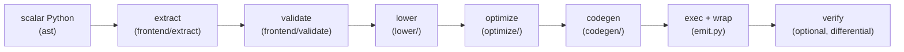

# Architecture

`vectorizer` is a source-to-source compiler. The pipeline runs eagerly
at decoration time. Orchestration lives in two modules at the top of
the package: `vectorizer/pipeline.py` (`compile_function`, the strict
stages below) and `vectorizer/api.py` (`vectorize` option handling, the
fallback decision, and the memoized helper cache); `__init__.py` is a
thin re-export of the public API.

## Stages

- **extract** (`frontend/extract.py`) — reads the function's AST,
  signature, defaults, and closure environment; resolves lambdas and
  nested pure functions.
- **validate** (`frontend/validate.py`) — rejects unsupported constructs,
  collecting *all* violations with line/column positions before failing.
- **lower** (`lower/`) — the semantic core: scalar control flow (`if`/`else`,
  early returns, `range` loops) becomes `xp.where` merges and explicit loop
  phis; scalar operations become Array API calls; dtype/kind inference
  (`_numeric_kind`, maybe-bool tracking) decides where the exactness
  helpers are needed.
- **optimize** (`optimize/`) — IR-level constant folding, dead-code
  elimination, and common-subexpression elimination on the scalar program.
- **codegen** (`codegen/`) — emits readable Python source from the lowered
  IR (SSA names, real loop structure).
- **exec + wrap** (`emit.py`) — compiles the source and wraps it so the
  namespace is taken from the call arguments
  (`array_api_compat.array_namespace`); `vec.source` and
  `inspect.getsource` expose the generated text.
- **verify** (`verify.py`) — with `verify=example_args`, runs a
  differential check of the generated function against the scalar original
  at generation time.

## Runtime helpers

Some lowerings cannot be expressed with bare Array API calls without
losing exactness (strict backends reject boolean arithmetic and
mixed-dtype promotion; naive casts round uint64 values). For those, the
generated code calls small runtime helpers injected into its globals:

- `_vec_minmax(xp, is_min, *args)` — exact `min`/`max` over mixed
  operands: boolean arrays normalize to int8, mixed-kind selections
  promote to the widest holding dtype, never-winning literals are
  clamped, and identical-dtype fast paths pass through untouched.
- `_vec_arith(xp, op_id, left, right=None)` — exact integer arithmetic
  for boolean/maybe-boolean/uint64 operands: implements the layered
  [exactness lattice](semantics.md#integer-exactness-lattice), including
  per-lane-exact uint64 `mod`/`floordiv` formulas for negative divisors
  and result-aware subtraction.

The helpers live in `vectorizer/runtime/` (`minmax.py`, `arith.py`,
`dtype.py`), a stdlib-only leaf. Lowering does not import them directly:
it goes through the `vectorizer/runtime/registry.py` seam
(`RUNTIME_HELPERS`), which maps each stable key to the emitted base
name and the injected callable.

Helper names are allocated collision-free per generated function and
memoized per (callee, protect) pair.

## Testing strategy

Tests are organized by level and behavior, never by discovery date:

- `tests/unit/` — white-box tests, one file per source module
  (frontend, ir, lower, optimize, codegen, runtime).
- `tests/behavior/` — black-box end-to-end semantics on NumPy:
  arithmetic dtype exactness, control flow, loops, calls/math/casts,
  closures and helpers, documented divergences.
- `tests/features/` — public-option behaviors: fallback, protected
  domains, differential verification.
- `tests/backends/` — array-api-strict compatibility.
- `tests/differential/` — Hypothesis compares generated functions
  against the scalar originals on edge values
  (`0, ±1, subnormals, ±inf, NaN`).
- `tests/golden/` — generated-source snapshots (`cases/`) compared
  via `ast.dump` equality, immune to formatting drift.
- Top level — `tests/test_inspectability.py` (source/`getsource`
  attributes), `tests/test_perf.py` (performance gate: within 5x of
  the hand-written array expression and >= 10x faster than
  `np.vectorize`), `tests/test_bench.py` (detailed timings, run
  `make bench`), and `tests/test_fuzz_smoke.py`.

The regression corpus from the 26-round independent adversarial
review is preserved inside `behavior/` and `features/` (provenance in
git history). A grammar fuzzer complements the suite:
`python -m vectorizer.fuzz` generates random scalar programs,
vectorizes, and differentially checks them; CI runs fixed seeds.
