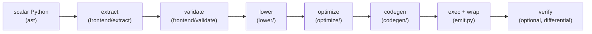

# Architecture

`array-vectorize` is a source-to-source compiler. The pipeline runs eagerly
at decoration time. Orchestration lives in two modules at the top of
the package: `array_vectorize/pipeline.py` (`compile_function`, the strict
stages below) and `array_vectorize/api.py` (`vectorize` option handling, the
fallback decision, and the memoized helper cache); `__init__.py` is a
thin re-export of the public API.

## Stages

- **extract** (`frontend/extract.py`) — reads the function's AST,
  signature, defaults, and closure environment; resolves lambdas and
  nested pure functions.
- **validate** (`frontend/validate.py`) — rejects unsupported constructs,
  collecting *all* violations with line/column positions before failing.
- **lower** (`lower/`) — the semantic core: scalar control flow (`if`/`else`,
  early returns, `range` loops) becomes `xp.where` merges and explicit loop
  phis; scalar operations become Array API calls; dtype/kind inference
  (`_numeric_kind`, maybe-bool tracking) decides where the exactness
  helpers are needed.
- **optimize** (`optimize/`) — IR-level constant folding, dead-code
  elimination, and common-subexpression elimination on the scalar program.
- **codegen** (`codegen/`) — emits readable Python source from the lowered
  IR (SSA names, real loop structure).
- **exec + wrap** (`emit.py`) — compiles the source and wraps it so the
  namespace is taken from the call arguments
  (`array_api_compat.array_namespace`); `vec.source` and
  `inspect.getsource` expose the generated text.
- **verify** (`verify.py`) — with `verify=example_args`, runs a
  differential check of the generated function against the scalar original
  at generation time.

## Runtime helpers

Some lowerings cannot be expressed with bare Array API calls without
losing exactness (strict backends reject boolean arithmetic and
mixed-dtype promotion; naive casts round uint64 values). For those, the
generated code calls small runtime helpers injected into its globals:

- `_vec_minmax(xp, is_min, *args)` — exact `min`/`max` over mixed
  operands: boolean arrays normalize to int8, mixed-kind selections
  promote to the widest holding dtype, never-winning literals are
  clamped, and identical-dtype fast paths pass through untouched.
- `_vec_arith(xp, op_id, left, right=None)` — exact integer arithmetic
  for boolean/maybe-boolean/uint64 operands: implements the layered
  [exactness lattice](semantics.md#integer-exactness-lattice), including
  per-lane-exact uint64 `mod`/`floordiv` formulas for negative divisors
  and result-aware subtraction.

The helpers live in `array_vectorize/runtime/` (`minmax.py`, `arith.py`,
`dtype.py`), a stdlib-only leaf (enforced, with the other import
boundaries, by `tests/unit/test_layering.py`). Lowering does not import them directly:
it goes through the `array_vectorize/runtime/registry.py` seam
(`RUNTIME_HELPERS`), which maps each stable key to the emitted base
name and the injected callable.

Helper names are allocated collision-free per generated function and
memoized per (callee, protect) pair.

## Design decisions

Source comments cite these by number (`design D6`). The user-facing
consequences are spelled out in [Semantics & divergences](semantics.md).

- **D1 — Eager branches.** Both sides of a branch evaluate on every lane
  and `xp.where` selects; `protect_domains` clamps partial-function
  arguments on provably dead lanes only, never changing results.
- **D2 — Exact `and`/`or`/`not`.** Numeric operands lower to
  value-selects (`x and y` → `xp.where(x != 0, y, x)`); provably boolean
  operands (the `is_bool` lattice in `ir/nodes.py`) use `xp.logical_*`.
- **D3 — Numeric exceptions become IEEE values.** Division by zero,
  domain errors, and complex-producing `pow` yield `inf`/`NaN` instead of
  raising; each case is a documented divergence.
- **D4 — No bare truthiness.** `if x:` is rejected as ambiguous per lane
  (write `if x != 0:`); a ternary's numeric condition is coerced with
  `!= 0`.
- **D5 — Collected diagnostics.** The validator reports *all* unsupported
  constructs at once, each with file/line/column and a caret excerpt.
- **D6 — Constant-trip loops only.** `for i in range(...)` with bounds
  known at generation time is emitted as a real loop over whole arrays;
  loop-carried variables become explicit phis.
- **D7 — Helper calls.** An inspectable pure callee is vectorized
  recursively and memoized by function object; anything else is rejected
  under `strict`, or wrapped in an element loop with `fallback=True`.
- **D8 — Frozen environment.** Closure and global scalars are captured as
  constants at generation time; arrays become hidden keyword parameters.
- **D9 — Backend neutrality.** Generated code contains only `xp.*` calls
  plus one `array_namespace` import (or the pinned `xp = _namespace`
  binding); no `np.` ever leaks into generated source.
- **D10 — Reject over miscompile.** Anything not provably translatable
  raises `VectorizationError`; there are no best-effort guesses.

Inspectability rests on two implementation choices: codegen builds an
`ast.Module` and calls `ast.unparse` (never string templating), and
`emit.py` registers the source in `linecache` with `mtime=None` so
`inspect.getsource` and tracebacks show the generated lines. The docstring
carries the original's documentation with a `(array-vectorized)` prefix on
the summary line plus the verbatim scalar source in a `Notes:` section
(Google style, or NumPy style when the original's docstring uses NumPy
section headers — `codegen/docstring.py`); codegen self-checks that the
source is recoverable from the built docstring and falls back to the legacy
source-only docstring when it cannot be. The wrapper deliberately does
**not** set `__wrapped__` (CPython's `getsourcelines` would unwrap to the
scalar original); it sets `__signature__`, `__name__`/`__qualname__`/
`__module__` from the original, and the `_vectorized_original` marker
instead. Canonical compilations (`vectorize(f)` without
`protect_domains`/`namespace`) are memoized per resolved original
(`api._CANONICAL_CACHE`) and point back at it via
`original.__array_vectorized__`; that is what keeps the back-reference
identity-stable.

## Testing strategy

Tests are organized by level and behavior, never by discovery date:

- `tests/unit/` — white-box tests, one file per source module
  (frontend, ir, lower, optimize, codegen, runtime), plus the fuzz
  smoke test (`test_fuzz.py`).
- `tests/behavior/` — black-box end-to-end semantics on NumPy:
  arithmetic dtype exactness, control flow, loops, calls/math/casts,
  closures and helpers, inspectability (`test_inspectability.py`:
  source/`getsource` attributes), documented divergences.
- `tests/features/` — public-option behaviors: fallback, protected
  domains, differential verification.
- `tests/backends/` — array-api-strict compatibility.
- `tests/differential/` — Hypothesis compares generated functions
  against the scalar originals on edge values
  (`0, ±1, subnormals, ±inf, NaN`).
- `tests/golden/` — generated-source snapshots (`cases/`) compared
  via `ast.dump` equality, immune to formatting drift.
- `tests/perf/` — the performance gate (`test_speed_gate.py`: within
  5x of the hand-written array expression and >= 10x faster than
  `np.vectorize`) and detailed timings (`test_bench.py`, run
  `make bench`).

The regression corpus from the 26-round independent adversarial
review is preserved inside `behavior/` and `features/` (provenance in
git history). A grammar fuzzer complements the suite:
`python -m array_vectorize.fuzz` generates random scalar programs,
vectorizes, and differentially checks them; CI runs fixed seeds.
